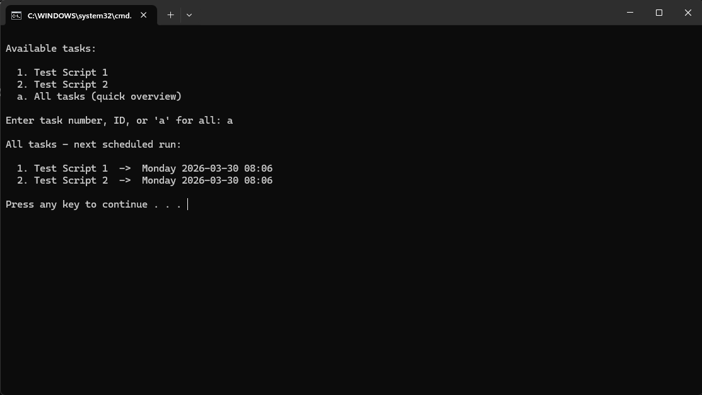
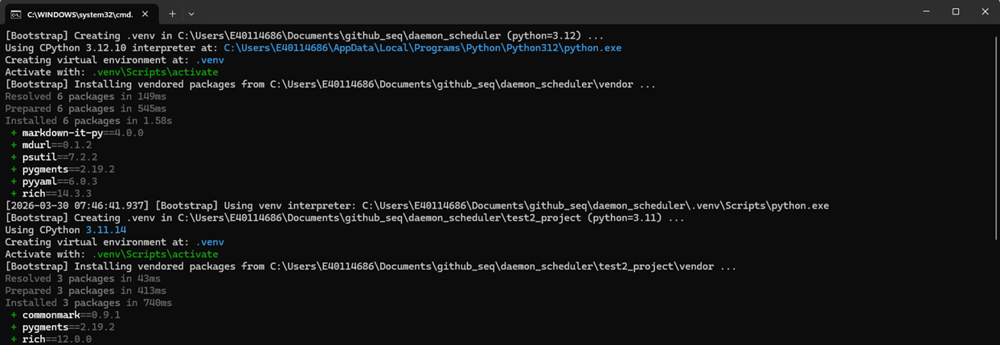
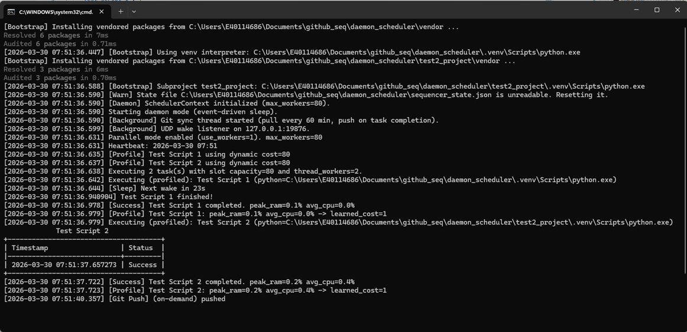
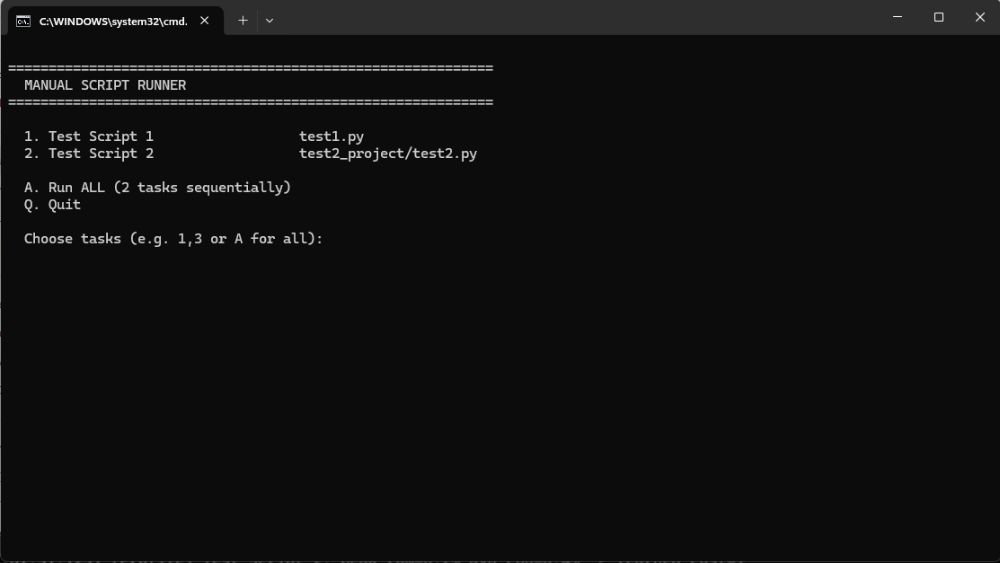

# How the Scheduler Works

There are two sides to this system: **developers** who write and push scripts, and a **scheduler laptop** that pulls and runs them on a schedule. Both sides have **git installed** and a **cloned copy of the repo** hosted on a **remote git server**.

---

## The Repo (on the Remote Server)

The repo is the single source of truth. It contains:

```
repo/
  sequencer.py          # The scheduler engine
  monitor.py            # Live dashboard
  schedule.yaml         # What to run and when
  settings.yaml         # Global config (parallelism, git sync, email)
  pyproject.toml        # Root project dependencies (see "Why pyproject.toml?" below)
  developer_prep.bat    # One-time dev setup script
  run_sequencer.bat     # Starts the scheduler
  run_monitor.bat       # Starts the dashboard
  check_schedule.bat    # Preview when a task will run
  check_schedule.py     # Schedule checker (used by check_schedule.bat)
  run_manual.bat        # Run scripts manually (fallback if scheduler is down)
  tests/                # Test suite (294 tests)
  bin/
    uv.exe              # Bundled package manager (no pip needed)
    python/             # Bundled Python interpreters (portable)
  vendor/               # Pre-downloaded .whl packages (offline install)
  logs/                 # Daily log files (auto-pushed by scheduler)
  sequencer_state.json  # Runtime state (auto-pushed by scheduler)
  test1.py              # Example task
  test2_project/        # Example subproject with its own dependencies
    test2.py
    pyproject.toml
    vendor/
```

---

## Side A: The Developer (Coder)

Developers write Python scripts, configure when they run, and push to the remote repo. They never need to run the scheduler themselves.

### First-Time Setup

1. Clone the repo:
   ```
   git clone <repo URL>
   ```

2. Run the prep script (only needed once, or when adding dependencies):
   ```
   developer_prep.bat
   ```
   This script:
   - Uses the bundled `bin/uv.exe` (no global Python/pip required)
   - Reads `pyproject.toml` to find the required Python version
   - Downloads portable Python interpreters into `bin/python/`
   - Downloads all dependency wheels into `vendor/` (and subproject `vendor/` folders)
   - Everything is committed to the repo so the scheduler laptop can install offline

### Daily Workflow

1. **Write your script.** Any Python file. It can use libraries listed in `pyproject.toml`.

2. **If your script needs a new library**, add it to `pyproject.toml` and re-run:
   ```
   developer_prep.bat
   ```
   This re-vendors the wheels so they're available offline on the scheduler laptop.

3. **If your script is a subproject** (its own folder with its own `pyproject.toml` and `vendor/`), the prep script handles it automatically. Subprojects can have different Python versions and dependencies.

4. **Add your script to `schedule.yaml`**:
   ```yaml
   tasks:
     - id: "My Daily Report"
       path: "scripts/daily_report.py"
       week_day: 1,2,3,4,5        # Mon-Fri
       start_hour: 9
       frequency_min: 60           # Every hour
       end_hour: 17
   ```

   Every task requires an `id` (unique name) and a `path` (path to the Python script, relative to repo root). All other fields are optional:

   | Field             | Description                                      |
   |-------------------|--------------------------------------------------|
   | `month`           | 1-12, comma-separated (default: all)             |
   | `month_day`       | 1-31, comma-separated (default: all)             |
   | `week_day`        | 1-7 where 1=Mon, 7=Sun. Use this or `month_day`, not both. If both are set, only `month_day` is used. |
   | `start_hour`      | 0-23. Required to set a specific run time. If omitted, task runs every minute. |
   | `start_minute`    | 0-59 (default: 0)                                |
   | `frequency_min`   | Repeat every N minutes (if blank, runs once)     |
   | `end_hour`        | 0-23 (if omitted, repeats non-stop)              |
   | `end_minute`      | 0-59 (default: 0)                                |
   | `times`           | Comma-separated `HH:MM` values for multiple specific run times (e.g. `"9:00, 14:00, 17:30"`). Cannot be combined with `start_hour`/`frequency_min`. |
   | `depends_on`      | Task ID(s) that must succeed first (e.g. `"task-A"` or `"task-A, task-B"`) |
   | `timeout_minutes` | Kill the script if it runs longer than N minutes |

   **If you've used cron before:** cron packs everything into five fields like `*/30 9-17 * * 1-5`. It works, but you always end up googling the field order. We use plain YAML fields instead, so `start_hour: 9, frequency_min: 30, end_hour: 17, week_day: 1,2,3,4,5` does the same thing and you can actually read it. Here's a quick translation table:

   | Cron expression | What it means | schedule.yaml equivalent |
   |-----------------|---------------|--------------------------|
   | `*/30 * * * *` | Every 30 min, all day | `frequency_min: 30` |
   | `0 9 * * *` | Once daily at 9:00 AM | `start_hour: 9` |
   | `0 9 * * 1-5` | 9:00 AM on weekdays | `start_hour: 9` + `week_day: 1,2,3,4,5` |
   | `*/30 9-17 * * 1-5` | Every 30 min, 9-17, weekdays | `start_hour: 9, frequency_min: 30, end_hour: 17, week_day: 1,2,3,4,5` |
   | `0 9,14,17 * * *` | 9:00, 14:00, 17:00 daily | `times: "9:00, 14:00, 17:00"` |
   | `0 6 1 * *` | 6:00 AM on 1st of month | `start_hour: 6, month_day: 1` |
   | `59 23 31 12 *` | Dec 31 at 23:59 | `start_hour: 23, start_minute: 59, month: 12, month_day: 31` |

5. **Before pushing, verify your schedule.** Double-click `check_schedule.bat` to confirm exactly when your task will run:

   
   *Enter a task number or `a` for all tasks — shows the next scheduled run time for each.*

6. **Push to the remote repo**:
   ```
   git add .
   git commit -m "add daily report script"
   git push
   ```
   The scheduler laptop will pick up changes on its next `git pull` cycle.

### What the Developer Commits

- Their Python scripts
- `schedule.yaml` (updated with new tasks)
- `pyproject.toml` (if dependencies changed)
- `vendor/*.whl` files (so the scheduler can install offline)
- `bin/python/` (portable interpreters, if a new version was needed)

### What the Developer Does NOT Touch

- `sequencer_state.json` (managed by the scheduler)
- `logs/` (written by the scheduler)
- `settings.yaml` (usually set once, rarely changed)

---

## Side B: The Scheduler Laptop

The scheduler laptop runs the sequencer 24/7. It does not need Python or any libraries pre-installed. Everything is bundled in the repo. The scheduler uses zero CPU while idle (event-driven sleep) to prevent overheating and unnecessary battery drain.

### First-Time Setup

1. Clone the repo:
   ```
   git clone <repo URL>
   ```

2. Double-click `run_sequencer.bat`. That's it.

   On first launch, the sequencer automatically:
   - Creates a `.venv` using the bundled `bin/uv.exe` and `bin/python/` interpreters
   - Installs all dependencies from `vendor/*.whl` files (fully offline, no internet needed)
   - Does the same for every subproject that has its own `pyproject.toml`
   - Starts the daemon loop


*The sequencer automatically creates the virtual environment and installs all packages on first launch — no manual setup needed.*

### What Happens When the Scheduler Runs

The sequencer runs in **daemon mode** (`sequencer.py --daemon`). A daemon is a program that runs continuously in the background. It starts, loops forever, and only stops when you close the terminal or press `Ctrl+C`. Here is what happens on each cycle:

```
   START
     |
     v
  [Bootstrap]
  Create .venv if missing, install vendored wheels
  Do the same for each subproject
     |
     v
  +----------------------------------+
  |   EVENT-DRIVEN SCHEDULER LOOP    | <-- loops forever
  |                                  |
  |  1. Reload Config                |
  |     Re-read schedule.yaml and    |
  |     settings.yaml (picks up any  |
  |     new tasks the devs added)    |
  |                                  |
  |  2. Process Commands             |
  |     Drain queued commands from   |
  |     the monitor (sent via UDP):  |
  |     pause, unpause, run-now.     |
  |     Update paused_tasks in state.|
  |                                  |
  |  3. Run Scheduler Pass           |
  |     For each task in schedule.yaml:
  |       - Check if current time matches the schedule
  |       - Check if it already ran in this time slot
  |       - Check if task is paused (skip if so)
  |       - Check if dependencies have succeeded
  |       - If it should run: execute the script
  |         - Find the right Python interpreter
  |           (subproject venv > root venv > system)
  |         - Launch the script as a separate process
  |         - Kill if timeout_minutes exceeded
  |         - Measure CPU% and RAM% while it runs
  |         - Log result (success/failure) to daily log
  |         - If failed: auto-retry with exponential
  |           backoff (60s, 120s, 240s, ..., max 30m)
  |                                  |
  |  4. Compute Next Wake Time       |
  |     Scan the schedule to find    |
  |     the exact minute when the    |
  |     next task fires. Also check  |
  |     retry timers for failed tasks|
  |                                  |
  |  5. Sleep Until Next Event       |
  |     Sleep with zero CPU until:   |
  |       - The next task is due, OR |
  |       - The monitor sends a      |
  |         command via UDP          |
  +----------------------------------+

  BACKGROUND THREADS (run independently):

  [Git Sync Thread]
    - Smart pull: fetches first, only pulls when remote has new commits
    - Push on demand: pushes immediately after any task finishes
    - Also supports timed intervals and manual triggers
    - Sleeps between operations (zero CPU)

  [UDP Listener Thread]
    - Listens on 127.0.0.1:19876 for commands
    - Wakes the main loop or git thread instantly
    - Zero CPU while waiting (OS-level blocking)
```


*The sequencer daemon in action — timestamped task execution with git sync, retries, and per-task output.*

### Event-Driven Sleep (Zero CPU While Idle)

The scheduler is designed to use zero CPU when no tasks are running. Here is how each component achieves this:

**Main loop.** After running a scheduler pass, the sequencer calculates exactly when the next task is due by scanning the schedule forward minute-by-minute (up to a 60-minute horizon). It then calls `threading.Event.wait(timeout=seconds_until_next_task)`, which is an OS-level blocking wait. The thread is suspended by the kernel and consumes no CPU cycles until either the timeout expires or the event is set by another thread.

**UDP listener.** A background thread calls `socket.recvfrom()` on a UDP socket bound to `127.0.0.1:19876`. This is also an OS-level blocking wait. The thread sleeps until a packet arrives. When the monitor sends a command (pause, run, pull, push), the listener receives it, places it on a thread-safe queue, and wakes the main loop or git thread by setting their respective `threading.Event`.

**Git sync thread.** Uses **smart pull**: runs `git fetch` first and checks `git rev-list HEAD..@{u} --count` to see if the remote has new commits. Only runs `git pull` (and resyncs vendor packages) when there are actual changes, skipping the pull entirely otherwise. For pushing, the thread wakes **immediately after any task finishes** (success or failure) to push logs and state to the remote. This means developers see results in near-real-time instead of waiting for a timed interval. The thread also supports timed intervals and manual triggers via the monitor's `p`/`u` keys.

**Monitor key polling.** The only component that polls. It checks for keyboard input every 0.5 seconds using `msvcrt.kbhit()` (Windows has no blocking keyboard API). This is 120 wakes per minute, negligible CPU, and only runs when the monitor dashboard is open.

**UDP message protocol.** The monitor sends short UTF-8 strings over UDP:

| Command | Meaning | Handled by |
|---------|---------|------------|
| `pull` | Force git pull now | Git sync thread |
| `push` | Force git push now | Git sync thread |
| `pause:<task_id>` | Pause a task | Main loop |
| `unpause:<task_id>` | Resume a task | Main loop |
| `run:<task_id>` | Run a task immediately | Main loop |

**Why UDP?** It is the lightest possible IPC mechanism. Creating a socket, sending one packet, and closing it takes a single syscall. There is no connection setup (unlike TCP), no file I/O (unlike trigger files), and no polling needed on the receiver side. On localhost, UDP delivery is essentially guaranteed.

**Laptop suspend/resume.** When the laptop lid is closed and reopened, `Event.wait(timeout)` returns because the timeout has expired (or the OS resumes the thread). The main loop wakes, recalculates the next wake time with the current (post-resume) clock, and proceeds normally. No special handling is needed.

### Parallel Execution

When `use_workers: 1` in `settings.yaml`, the scheduler can run multiple tasks at the same time instead of waiting for one to finish before starting the next.

To avoid overloading the laptop, the scheduler uses a **cost budget** system:

- The total budget is set by `max_workers` (default: 80). Think of this as "80% of the laptop's capacity is available for scripts, 20% is reserved for the operating system."
- Each task has a **worker cost**, a number representing how much CPU and RAM it uses. The scheduler learns this automatically by measuring each task while it runs (profiling).
- Before starting a task, the scheduler checks: "Is there enough budget left?" If yes, the task runs. If not, it waits until a running task finishes and frees up budget.
- New scripts that haven't been profiled yet start with `default_worker_cost` (default: 80, meaning "assume it's heavy until proven otherwise"). After the first run, the cost adjusts based on actual measurements.

### What the Scheduler Pushes Back

Only two things:
- `sequencer_state.json` (task run times, profiling data, in-progress state)
- `logs/` (daily log files with task output and timestamps)

This lets developers check task results by pulling from the remote repo.

### The Monitor Dashboard

Optionally, open a second terminal and run `run_monitor.bat` to see a live dashboard showing:
- Task statuses (running, succeeded, failed, paused)
- CPU/RAM profiling per task
- Today's schedule timeline (past, current, future slots)
- Git sync status (smart pull countdown, last push time)
- Interactive controls:
  - `Tab` to switch sections
  - `Up/Down` to scroll within a section
  - `Space` to pause/resume the selected task
  - `r` to run the selected task immediately
  - `p` to force a git pull, `u` to force a push
  - `q` to quit

If the scheduler is down, `run_manual.bat` lets you pick and run scripts directly without the daemon:


*Manual runner — select tasks by number or run all sequentially.*

### Running on Any Laptop

The scheduler is fully portable. To move it to a different laptop:

1. Clone the repo
2. Run `run_sequencer.bat`

No installs needed. The repo carries:
- `bin/uv.exe` (package manager)
- `bin/python/` (Python interpreters)
- `vendor/` (all dependency wheels)

The bootstrap runs automatically on first launch.

### Recommended Power Settings

The scheduler is designed for 24/7 operation. To prevent the laptop from sleeping (which freezes all processes, so no software can run during Windows sleep), configure Windows power settings:

1. Open **Settings > System > Power & battery** (or **Control Panel > Power Options**)
2. Set **Sleep** to **Never** (both on battery and plugged in)
3. Set **Screen** to turn off after a few minutes (saves power without affecting the scheduler)
4. If on a laptop, set **Close lid action** to **Do nothing** (so closing the lid doesn't trigger sleep)

The scheduler uses zero CPU while idle (event-driven sleep with OS-level blocking waits), so leaving it running 24/7 does not cause overheating or unnecessary battery drain. The CPU only wakes when a task is due or a monitor command arrives.

---

## The Two-Way Git Flow

```
  DEVELOPER                    REMOTE REPO              SCHEDULER LAPTOP
  ---------                    -----                    ----------------

  Write scripts       --->   git push   --->        Smart pull (fetch + check)
  Update schedule.yaml                                Re-sync packages
  Update pyproject.toml                               Run tasks on schedule
  Vendor new wheels

                                                      Push after each task completes
  git pull            <---   git pull   <---        Push state + logs
  Check logs/
  Check state
```

Developers push **code, config, and wheels**. The scheduler pushes back **state and logs**. Both sides stay in sync through the remote repo.

---

## Why `pyproject.toml`?

`pyproject.toml` is the Python standard (PEP 621) for declaring project metadata and dependencies. We use it instead of a plain `requirements.txt` because it also carries the required Python version (`requires-python = ">=3.12"`). The bootstrap reads this to pick the right bundled interpreter from `bin/python/`. A `requirements.txt` cannot do that.

## Why `.yaml` for config?

YAML is human-friendly. `schedule.yaml` and `settings.yaml` are meant to be edited by developers by hand. YAML supports comments (lines starting with `#`), which lets us document scheduling options right inside the file. JSON does not allow comments, making it a poor choice for config files that humans need to read and edit.

## Why `.json` for state?

`sequencer_state.json` is never edited by humans. It is read and written by the sequencer programmatically. JSON is the natural choice here because Python's built-in `json` module handles it with no extra dependencies, and it round-trips data types (numbers, booleans, lists) without ambiguity. It is also easy to inspect when debugging.

## Why `.bat` scripts?

The goal is to run the scheduler on any Windows laptop with zero setup. `.bat` files are native to Windows. Double-click to run, no interpreter needed. They handle the bootstrapping (finding `uv.exe`, creating `.venv`, launching the sequencer) so that the user never has to open a terminal or type commands.

## What is `vendor/`?

`vendor/` holds pre-downloaded `.whl` (wheel) files, which are Python packages in their installable form. When a developer runs `developer_prep.bat`, it downloads every dependency listed in `pyproject.toml` as a `.whl` file into `vendor/`. These wheels are committed to the repo.

This is what makes the scheduler laptop work **without internet**. On first launch (or after a `git pull` brings new wheels), the bootstrap installs packages from `vendor/` using `uv pip install --no-index --find-links vendor/`, fully offline, no PyPI access needed.

Subprojects can have their own `vendor/` folder (e.g. `test2_project/vendor/`) for dependencies specific to that subproject.

## What is `.venv`?

`.venv` is a **virtual environment**, an isolated folder where Python and its installed packages live. Each machine (developer laptop, scheduler laptop) creates its own `.venv` locally. It is **not committed to the repo** because:

1. It contains compiled files and symlinks that are tied to the specific machine and OS
2. It is large and would bloat the repo unnecessarily
3. It can be recreated at any time from `vendor/` + `pyproject.toml`

The bootstrap creates `.venv` automatically on first launch using `uv venv`, then installs packages into it from the vendored wheels. If `.venv` gets deleted or corrupted, just re-run the sequencer or `developer_prep.bat` and it will be rebuilt from scratch.

## What is `bin/`?

`bin/` contains everything needed to set up Python on a machine that has nothing installed:

- **`uv.exe`** (explained below in "What is `uv`?")
- **`python/`** (portable Python interpreters downloaded by `developer_prep.bat`). These are standalone copies of Python that do not require a system-wide install.

We bundle Python inside `bin/python/` because the scheduler laptop **has no Python installed**. When the bootstrap needs to create a `.venv`, `uv` picks the right interpreter from `bin/python/` based on the version declared in `pyproject.toml` (e.g. `>=3.12`). This way the entire toolchain lives inside the repo. Clone and run, nothing else to install.

## What is `uv`?

`uv` (by [Astral](https://github.com/astral-sh/uv)) is a single `.exe` file that replaces three tools Python developers normally install separately:

| Traditional tool | What it does | `uv` equivalent |
|------------------|-------------|------------------|
| `python` installer | Install Python on the system | `uv python install 3.12` |
| `python -m venv` | Create a virtual environment | `uv venv` |
| `pip install` | Install packages | `uv pip install` |

The key advantage: **`uv` itself does not need Python to run**. It is a compiled binary written in Rust. This solves the chicken-and-egg problem. You normally need Python to install Python packages, but `uv` can do it all from scratch.

In this project, `uv` is used for:
1. **`developer_prep.bat`**: downloads portable Python interpreters into `bin/python/`, then downloads dependency wheels into `vendor/`
2. **Bootstrap (on scheduler startup)**: creates `.venv` using the bundled Python from `bin/python/`, then installs packages from `vendor/`, all offline, no internet needed

## What is a subproject?

A subproject is a folder inside the repo that has its own `pyproject.toml` (and optionally its own `vendor/`). Example: `test2_project/`.

Use a subproject when your script needs **different dependencies or a different Python version** than the root project. For example, if the root requires Python 3.12 but your script needs a library that only works on 3.11, put it in its own folder with its own `pyproject.toml` declaring `requires-python = ">=3.11"`.

If your script is fine with the root dependencies, just place it next to `test1.py`. No subproject needed.

The scheduler handles subprojects automatically: it creates a separate `.venv` for each one and uses the correct interpreter when running their scripts.

## What happens when a task fails?

A task "fails" when the Python script exits with a non-zero exit code (e.g. an unhandled exception, `sys.exit(1)`, etc.).

When a task fails:
1. The failure is logged to the daily log file in `logs/`
2. The task is automatically retried with **exponential backoff**. This means the wait time between retries doubles each time: 60 seconds after the 1st failure, then 120s, 240s, 480s, 960s, and so on. The delay is capped at `retry_max_delay_seconds` (default: 1800s = 30 minutes), so it never waits longer than that. This prevents the scheduler from hammering a broken task every minute while still retrying regularly.
3. Retries continue indefinitely until the task succeeds or the schedule window ends
4. When the task finally succeeds, the retry counter resets to 0, so if it fails again later, backoff starts fresh from 60s
5. If `error_email.py` is scheduled in `schedule.yaml`, it will report the failure in its next summary email

Developers can check task results by:
- Pulling from the remote repo and reading `logs/`
- Pulling from the remote repo and checking `sequencer_state.json` for task statuses
- Running `run_monitor.bat` on the scheduler laptop to see live status

## How do task dependencies work?

Use `depends_on` in `schedule.yaml` to make a task wait for another task to finish successfully before it runs. There are two modes:

### Mode 1: Dependency-only (no schedule)

If a task has `depends_on` but **no schedule fields** (`start_hour`, `frequency_min`, `times`, etc.), it becomes a **dependency-only** task. It has no schedule of its own and runs automatically right after all its dependencies succeed, with zero delay and no polling.

```yaml
tasks:
  - id: "fetch-data"
    path: "scripts/fetch.py"
    start_hour: 9

  - id: "process-data"
    path: "scripts/process.py"
    depends_on: "fetch-data"
```

In this example, `process-data` has no `start_hour` or `frequency_min`, so it is purely event-driven. When `fetch-data` finishes successfully, the scheduler immediately triggers `process-data`. If `fetch-data` fails, `process-data` never runs.

This works with chains too. If A triggers B and B triggers C, the entire chain fires automatically:

```yaml
tasks:
  - id: "A"
    path: "scripts/a.py"
    start_hour: 9

  - id: "B"
    path: "scripts/b.py"
    depends_on: "A"

  - id: "C"
    path: "scripts/c.py"
    depends_on: "B"
```

A task can also depend on multiple parents: `depends_on: "A, B"`. It only triggers when **all** listed dependencies have succeeded.

### Mode 2: Scheduled with dependencies

If a task has `depends_on` **and** schedule fields, it runs on its own schedule but only when the dependencies have succeeded in the same time slot:

```yaml
tasks:
  - id: "fetch-data"
    path: "scripts/fetch.py"
    start_hour: 9

  - id: "process-data"
    path: "scripts/process.py"
    start_hour: 9
    start_minute: 15
    depends_on: "fetch-data"
```

Here `process-data` is scheduled at 9:15 but only runs if `fetch-data` has already succeeded. If it hasn't, the scheduler checks again on the next tick.

### General rules

- You can depend on multiple tasks: `depends_on: "task-A, task-B"`. All must succeed.
- A **time slot** is the minute when a task is scheduled. The scheduler checks dependencies within the same slot.
- If a dependency references a task ID that doesn't exist in `schedule.yaml`, the scheduler logs an error.

## How do task timeouts work?

Use `timeout_minutes` to automatically kill a script that runs too long:

```yaml
tasks:
  - id: "slow-report"
    path: "scripts/report.py"
    start_hour: 9
    timeout_minutes: 10
```

If `report.py` is still running after 10 minutes, the scheduler forcefully kills it. The task is marked as failed, which triggers the normal retry logic (with exponential backoff). This prevents a hanging script from blocking the scheduler forever.

## How does pause/resume work?

You can pause and resume individual tasks from the monitor dashboard without editing `schedule.yaml`:

1. Open the monitor (`run_monitor.bat`)
2. Make sure the "tasks" section is focused (press `Tab` to switch sections)
3. Use `Up`/`Down` arrows to select a task
4. Press `Space` to toggle pause/resume

When you pause a task, the monitor sends a UDP command (e.g. `pause:My Task`) to the sequencer on `127.0.0.1:19876`. The sequencer receives it instantly, adds the task to a `paused_tasks` list in `sequencer_state.json`, and wakes up to process the change. Paused tasks are skipped in all passes (scheduling, retries, and crash recovery).

The UDP approach keeps the monitor and sequencer cleanly separated. The monitor sends commands, and the sequencer is the only process that reads and writes the state file, avoiding any conflicts.

## How does "run now" work?

You can trigger any task to run immediately from the monitor, regardless of its schedule:

1. Open the monitor (`run_monitor.bat`)
2. Make sure the "tasks" section is focused (press `Tab` to switch sections)
3. Use `Up`/`Down` arrows to select a task
4. Press `r` to run it now

This works the same way as pause/resume. The monitor sends a UDP command (e.g. `run:My Task`), and the sequencer receives it instantly and runs the task immediately, even if it's outside its normal time slot.

Notes:
- If the task is currently paused, the run-now request is ignored. Unpause it first.
- If the task is already running or already queued for this tick, the request is ignored (no duplicate runs).
- The task runs with all the same behavior as a scheduled run: profiling, timeout, logging, etc.

## What if the scheduler is down?

Double-click `run_manual.bat`. It reads `schedule.yaml`, shows a numbered menu of all tasks, and lets you pick which ones to run sequentially. It respects `depends_on` ordering: dependencies run first, and if a dependency fails, its dependents are skipped.

This is a standalone fallback that doesn't use the sequencer at all. It parses the YAML with regex (no PyYAML needed), so it works even if the `.venv` is broken. It uses the same interpreter resolution as the sequencer (subproject `.venv` > root `.venv` > system Python).

## Can I run non-Python scripts?

This is a Python scheduler. It bundles Python interpreters, manages Python virtual environments, and installs Python packages. That said, you can run other languages with some workarounds:

- **Compiled executables** (Rust, C++, Go): compile on your dev machine and commit the `.exe` to the repo. Point `path` at it in `schedule.yaml`. The scheduler would need a small code change to detect non-`.py` files and run them directly instead of through a Python interpreter.
- **JavaScript**: you'd need to bundle `node.exe` in `bin/` (similar to how Python is bundled) and add bootstrap logic for npm packages.
- **Batch/PowerShell**: same idea, detect the extension and run natively.

Full multi-language support (downloading compilers, managing non-Python dependencies) is possible but adds significant complexity for minimal benefit. For now, if you need another language, the simplest approach is to compile it into an `.exe` and commit it, or wrap it in a Python script using `subprocess`.

## How does crash recovery work?

When the scheduler starts a task, it records it in the `in_progress` section of `sequencer_state.json` before the script begins running. When the script finishes (success or failure), the entry is removed from `in_progress` and the result is saved to `last_triggered_slot`.

If the laptop crashes, loses power, or restarts while a task is running, the `in_progress` entry survives because it was already written to disk. On the next startup, the scheduler sees this leftover entry and knows the task was interrupted. It re-queues the task automatically. This is the **recovery pass**, which runs before the normal scheduling pass every tick.

## How do logs work?

The scheduler creates one log file per day in the `logs/` folder, named by date (e.g. `logs/2026-03-05.log`). Each log file contains timestamped entries for everything that happens: task starts, completions, failures, retries, git syncs, etc.

When `log_task_output: true` in `settings.yaml` (the default), the actual output of your scripts (anything they print to the terminal) is also captured and included in the log. Set it to `false` if you don't need script output in the logs.

Old log files are automatically deleted based on `log_keep_count` (default: 14). This means the scheduler keeps the last 14 daily log files and deletes anything older, preventing the `logs/` folder from growing forever.

## How do email notifications work?

Email notifications are handled by two standalone scripts that the sequencer runs as scheduled tasks, just like any other script. They are not built into the sequencer itself. This keeps them isolated: if email sending fails or hangs, it does not affect the scheduler or any other running tasks.

- **`daily_report_email.py`** reads `sequencer_state.json` and `schedule.yaml` to build a full status report: successful tasks, failed tasks, missed tasks, and paused tasks. If nothing ran and nothing was missed, no email is sent.
- **`error_email.py`** reads `sequencer_state.json`, checks for failed tasks, and sends a summary email. If no tasks have failed, no email is sent.

Both scripts read their SMTP configuration from `settings.yaml`:

```yaml
email:
  smtp_server: "mailhub.utc.com"
  smtp_port: 25                        # 25 = no auth, 587 = TLS + auth
  from: "sender@example.com"
  to: "recipient@example.com"
  cc: "cc1@example.com;cc2@example.com"
  # username: ""                       # uncomment for authenticated SMTP (port 587)
  # password: ""                       # app password, not your real password
```

Their schedule is configured in `schedule.yaml` like any other task:

```yaml
  - id: "Daily Report"
    path: "emails/daily_report_email.py"
    times: "7:00, 12:00, 17:00"

  - id: "Error Email"
    path: "emails/error_email.py"
    times: "5:00, 12:00, 17:00, 0:00"
```

### SMTP setup

The scripts send email via SMTP (Simple Mail Transfer Protocol). Two modes are supported:

- **Internal relay (no auth):** Most companies have an internal mail relay server (e.g. `mailhub.utc.com`). It accepts emails from machines on the corporate network without requiring a username or password. Use `smtp_port: 25` and leave `username`/`password` commented out. If you don't know your company's relay hostname, ask your IT team.
- **Authenticated (TLS):** For public email providers like Gmail (`smtp.gmail.com`) or Outlook.com (`smtp-mail.outlook.com`), use `smtp_port: 587` and fill in `username` and `password`. The scripts will automatically use TLS encryption and authenticate before sending. Note: some corporate firewalls block outbound connections to external SMTP servers on port 587. If that's the case, use your company's internal relay instead.

## What is the monitor's "Today's Schedule" view?

The monitor has three sections you can switch between with `Tab`: **tasks**, **profiling**, and **schedule**.

The **schedule** section shows a timeline of today's schedule, every time slot where at least one task is configured to run. Past slots are dimmed, the current slot is highlighted in green, and future slots are shown normally. This lets you quickly see what ran, what's running now, and what's coming up, without having to mentally parse `schedule.yaml`.

## How do I check when a task will run?

After adding or editing a task in `schedule.yaml`, you probably want to verify it will actually run when you expect. Double-click `check_schedule.bat` and it walks you through it:

1. It shows all your tasks as a numbered list
2. Pick a task (by number or ID), or type `a` to see a quick overview of all tasks
3. Choose how far ahead to look: 7 days, 30 days, or 365 days
4. It shows every time that task would run in that window

If a day has many runs (e.g. every 30 minutes), it collapses them into a summary like `09:00 to 17:00 every 30 min (17 runs)` instead of listing each one.

If no runs are found, it prints the task's schedule config so you can spot what's wrong (wrong month, wrong day, etc.).

**Quick overview mode:** typing `a` instead of a task number shows one line per task with the next scheduled run time. This scans up to a year ahead for each task, so even monthly and yearly tasks show up.

```
All tasks - next scheduled run:

  1. Daily Report      ->  Monday 2026-03-09 09:00
  2. Monthly Sync      ->  Tuesday 2026-04-01 06:00
  3. Year End Backup   ->  Thursday 2026-12-31 23:59
```

## Command-Line Flags

The sequencer supports these flags when run directly (outside of `run_sequencer.bat`):

| Flag | Example | Description |
|------|---------|-------------|
| `--config <path>` | `--config schedule.yaml` | Which schedule file to use (default: `schedule.yaml`) |
| `--daemon` | `--daemon` | Run continuously forever, checking every minute. This is what `run_sequencer.bat` uses. Without this flag, the sequencer runs **one pass** and exits |
| `--dry-run` | `--dry-run` | Show which tasks would run at the current time without actually executing any scripts. Useful for testing your schedule |
| `--now <time>` | `--now 2026-12-25T09:00` | Pretend it's a different date/time. Useful for testing whether your schedule triggers correctly on specific dates. Cannot be combined with `--daemon` |

**Examples:**

```
# Normal production usage (what run_sequencer.bat does):
python sequencer.py --daemon

# Test what would run right now without executing anything:
python sequencer.py --dry-run

# Test what would run on Christmas morning at 9 AM:
python sequencer.py --now 2026-12-25T09:00 --dry-run

# Run one pass and exit (useful for cron-style setups):
python sequencer.py --config schedule.yaml
```

## Settings Reference

All settings live in `settings.yaml`. Here is a complete reference:

| Setting | Default | Description |
|---------|---------|-------------|
| `retry_delay_seconds` | 60 | Initial delay (in seconds) before retrying a failed task |
| `retry_max_delay_seconds` | 1800 | Maximum retry delay (30 min). Backoff doubles each time but never exceeds this |
| `use_workers` | 1 | `1` = run tasks in parallel, `0` = run one at a time |
| `max_workers` | 80 | Total budget for parallel tasks (80 = 80% of capacity for scripts) |
| `default_worker_cost` | 80 | Cost assigned to new scripts before profiling data exists |
| `log_task_output` | true | Capture script output (print statements) into daily log files |
| `log_keep_count` | 14 | Keep this many daily log files, auto-delete older ones |
| `git_pull_interval_minutes` | 10 | How often to smart-pull from the remote repo (0 = disabled). Fetches first, only pulls when remote has new commits. |
| *(push is event-driven)* | — | Push happens automatically after each task completes. Also supports on-demand push via monitor (`u` key). |
| `email.smtp_server` | *(required)* | SMTP server hostname (e.g. `mailhub.utc.com`). Ask your IT team for the internal relay. |
| `email.smtp_port` | 25 | `25` for internal relays (no auth), `587` for public providers (TLS + auth) |
| `email.from` | *(required)* | Sender email address |
| `email.to` | *(required)* | Recipient email address |
| `email.cc` | `""` | CC addresses, semicolon-separated |
| `email.username` | `""` | SMTP username (only for port 587 with TLS) |
| `email.password` | `""` | SMTP password / app password (only for port 587 with TLS) |
