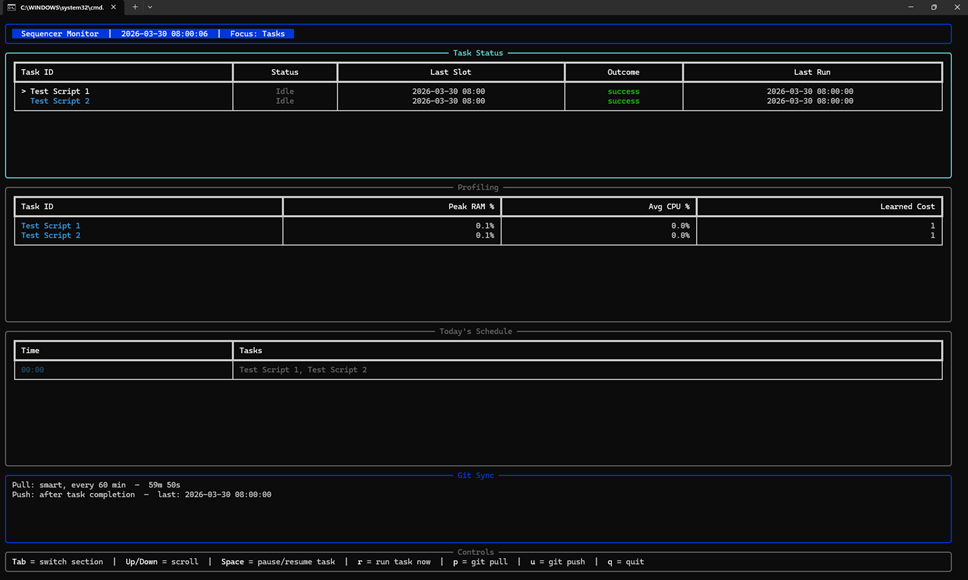

# Scheduler

A portable, offline Python task scheduler. Clone the repo, double-click a `.bat` file, and it runs your scripts on a schedule. Forever.

---

## Why This Exists

This project was built around a specific set of constraints:

- **The scheduler laptop has no internet.** It sits on a restrictive company network where nothing can be downloaded. Everything the scheduler needs is bundled inside the repo.
- **The laptop has no Python installed.** The repo ships its own copy of Python and all required libraries. This also makes the scheduler fully transferable. If the laptop breaks, clone the repo on a new machine and it runs identically.
- **No database is accessible.** IT restrictions block database access, so all data is stored in simple files (JSON and YAML) inside the repo.
- **The scheduler never stops.** It runs 24/7 in the background. If the laptop crashes or restarts, it recovers automatically, picking up where it left off.
- **The laptop must not overheat.** The scheduler sleeps when there's nothing to do and only wakes up when a task is due. Zero CPU usage while idle.
- **Developers push code remotely.** They write scripts on their own machines and push to a shared git repo. The scheduler laptop pulls changes automatically.
- **It must be easy.** Write a script, add one line to `schedule.yaml`, push. Done.

## Features

- **Fully offline.** Works without internet, all libraries are pre-downloaded and bundled.
- **Fully portable.** Clone on any Windows laptop and run, nothing to install.
- **Zero CPU while idle.** Sleeps until the next task is due, wakes instantly when needed.
- **Crash recovery.** Remembers what was running and picks up where it left off after a restart.
- **Smart git sync.** Only pulls when there are actual changes, pushes results immediately after each task.
- **Parallel execution.** Runs multiple tasks at the same time, automatically balances CPU and memory usage.
- **Auto-retry.** If a task fails, it retries automatically with increasing wait times (1 min, 2 min, 4 min, ..., up to 30 min).
- **Task dependencies.** Make one task wait for another to finish before it runs. Tasks with `depends_on` but no schedule run automatically right after their dependencies succeed.
- **Task timeout.** Automatically kills scripts that run too long.
- **Multiple run times.** Schedule a task at specific times like `"9:00, 14:00, 17:30"` in one entry.
- **Pause/resume.** Pause and resume individual tasks from the dashboard without editing config.
- **Run now.** Trigger any task to run immediately from the dashboard, regardless of schedule.
- **Multi-Python.** Different scripts can use different Python versions and libraries.
- **Live dashboard.** Real-time terminal view showing task status, resource usage, schedule, and git sync state.
- **Email alerts.** Optional notifications when tasks fail or to confirm the scheduler is still alive.
- **Schedule checker.** Double-click `check_schedule.bat` to verify when a task will run before you push.
- **Manual runner.** Double-click `run_manual.bat` to pick and run scripts manually if the scheduler is down.


*Live dashboard showing task status, CPU/RAM profiling, today's schedule, and git sync state.*


*The sequencer daemon — timestamped task execution with git sync and per-task output.*

## Quick Start

### For Developers (write and push scripts)

```
git clone <repo URL>
developer_prep.bat              # one-time setup: downloads Python + libraries
```

Then write your script, add it to `schedule.yaml`, and push:

```
git add .
git commit -m "add my script"
git push
```

### For the Scheduler Laptop (runs scripts)

```
git clone <repo URL>
run_sequencer.bat               # starts automatically, runs forever
```

That's it. No Python install, no pip, no setup.

## Project Structure

```
repo/
  sequencer.py            # The scheduler engine
  monitor.py              # Live terminal dashboard
  schedule.yaml           # What to run and when
  settings.yaml           # Global config (parallelism, git sync, email)
  pyproject.toml          # Project dependencies + Python version
  developer_prep.bat      # Dev setup script
  run_sequencer.bat       # Starts the scheduler
  run_monitor.bat         # Starts the dashboard
  check_schedule.bat      # Check when a task will run
  check_schedule.py       # Schedule checker script
  run_manual.bat          # Run scripts manually (fallback)
  tests/                  # Test suite (294 tests)
  bin/
    uv.exe                # Bundled package manager
    python/               # Bundled Python interpreters
  vendor/                 # Pre-downloaded libraries (offline install)
  logs/                   # Daily log files
  sequencer_state.json    # Runtime state
```

Scripts can live at the root (e.g. `test1.py`), in a `scripts/` folder for organization, or in subprojects with their own dependencies (e.g. `test2_project/`).

## How It Works

```
DEVELOPER                      REMOTE REPO                SCHEDULER LAPTOP
---------                      -----------                ----------------

Write scripts         --->   git push   --->          Pulls changes automatically
Add to schedule.yaml                                    Installs new libraries
Bundle libraries                                        Runs tasks on schedule

                                                        Pushes after each task
git pull              <---   git pull   <---          Sends back logs + state
Check logs/
Check results
```

Developers write scripts and push them to a shared git repo. The scheduler laptop pulls changes on a timer, runs tasks according to `schedule.yaml`, and pushes results (logs and state) back to the repo so developers can check on things remotely.

For the full technical breakdown, see **[HOW_IT_WORKS.md](HOW_IT_WORKS.md)**.

## Requirements

**Just git.** Everything else is in the repo.
